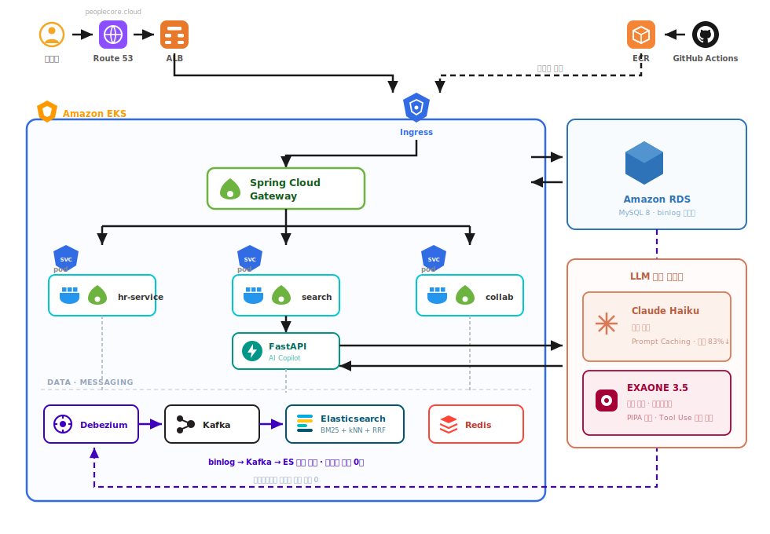
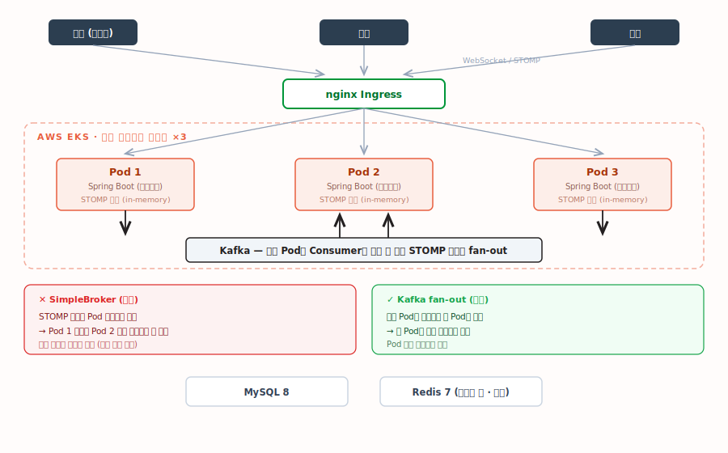

 

# 황주완 &nbsp;·&nbsp; Backend Developer

### 문제 중심으로 사고하는 개발자

표면적 해결보다 **근본 원인**을 먼저 찾고, 여러 대안을 비교해 **근거 위에서** 결정합니다. 
동시성 · 검색 · LLM 비용처럼 **조용히 틀리는 문제**를 수치로 확인하고 구조로 막습니다.

 

&nbsp;

 

---

## About

> [!NOTE]
> 강남대학교 소프트웨어전공 졸업 · 한화시스템 **Beyond SW Camp** 수료

<table>
<tr>
<td width="33%" valign="top">

**문제를 먼저 재현합니다**

부하 테스트로 재현되지 않은 문제는
고쳤는지 알 수 없습니다.
재고 중복 차감(에러율 75%)도
여기서 드러났습니다.

</td>
<td width="33%" valign="top">

**계층별로 책임을 나눕니다**

하나의 수단으로 막지 않습니다.
입구(Redis) · 처리(Kafka) ·
저장(DB Lock)이 각각 무엇을
책임지는지 명확히 합니다.

</td>
<td width="33%" valign="top">

**기각한 대안까지 남깁니다**

무엇을 선택했는지보다
**무엇을 왜 버렸는지**가
다음 사람에게 더 쓸모 있습니다.

</td>
</tr>
</table>

 

---

## PeopleCore

### HR SaaS ERP &nbsp; 

인사 · 근태 · 급여 · 성과 · 전자결재 · 협업 · AI Copilot을 하나로 묶은 **워크플로우 기반 엔터프라이즈 SaaS**.
회사별 결재선 · 근무 정책 · 급여 항목 · 평가 등급 분포를 **코드 수정 없이 운영 데이터만으로** 커스터마이징합니다.

|  |  |
|:--|:--|
| **기간** | 2026.03 – 2026.05 (3개월) |
| **인원** | 4인 · 백엔드 / AI · 인프라 |
| **담당** | 로그인(ID/PW · 안면인식) · 조직도 관리 · 통합검색 · 파일함 · AI Copilot |
| **스택** | `Spring Boot` `Spring Cloud` `Kafka` `Debezium` `Elasticsearch` `ChromaDB` `FastAPI` `EKS` `Vue3` |
| **성과** | Recall@5 **95%** · LLM 비용 **83%↓** · 안면인식 **27s → 3s** · 이벤트 누락 **0건** |

 

### 핵심 문제

<table>
<tr>
<td width="33%" valign="top">

**🔒 사내 데이터를 외부 LLM에 못 보낸다**

인사 · 급여를 외부 API로 보내는 순간
유출 위험이 생깁니다.
기능을 포기하는 대신
**민감도로 모델을 분기**했습니다.

`EXAONE`(온프레미스) ↔ `Claude`

</td>
<td width="33%" valign="top">

**🔍 형태소 분석만으론 부분 검색이 실패한다**

Nori로는 "결재문" 같은
복합어가 잡히지 않았습니다.
**BM25 + kNN을 RRF로 결합**했습니다.

`Recall@5 95%`

</td>
<td width="33%" valign="top">

**⚡ 앱이 발행하는 이벤트는 누락된다**

트랜잭션 커밋과 발행이
분리되기 때문입니다.
**발행 주체를 DB로 옮겼습니다.**

`Debezium CDC · 누락 0건`

</td>
</tr>
</table>

<b>&nbsp;상세 — EXAONE이 Tool Use를 지원하지 않는 문제</b>

 

EXAONE 3.5는 네이티브 함수 호출을 지원하지 않아 도구 호출형 Copilot 구현이 막혔습니다.
모델을 바꾸면 **PIPA 로컬 추론 요건과 충돌**하므로, 모델이 아니라 **구조**를 바꿔야 했습니다.

`[[CALL]]` 마커 기반 **Manual Prompting 프로토콜을 직접 설계**하고 응답을 파싱해
네이티브와 동등한 도구 호출을 구현했습니다.

> 제약을 만났을 때 도구를 바꾸는 대신, 구조로 같은 결과를 내는 방법을 택했습니다.

<b>&nbsp;상세 — 정확 매칭과 의미 검색을 함께 잡은 방법</b>

 

벡터(kNN) 의미 검색만으로는 **사번 · 부서명 같은 정확 키워드 매칭이 약했습니다.**
반대로 BM25만으로는 자연어 의도를 못 잡습니다. 둘은 **상호 보완 관계**였습니다.

- `ngram` 토크나이저를 멀티 필드로 추가 → 복합어 · 부분 문자열 대응
- **BM25 + kNN 벡터 검색을 RRF로 결합** → Elasticsearch 위에 Hybrid Search 구현

<b>&nbsp;상세 — LLM 비용을 83% 줄인 방법</b>

 

매 요청마다 동일한 시스템 프롬프트와 대화 이력을 반복 전송하고 있었습니다.
**Prompt Caching**으로 고정 컨텍스트를 캐시 키로 재사용하고 동적 입력만 전송했습니다.

| | 호출당 비용 |
|:--|--:|
| 적용 전 | $0.006202 |
| 적용 후 | **$0.001075** |

5,697 토큰 고정 컨텍스트 · Claude Haiku 기준

<b>&nbsp;상세 — 로그인에 27초가 걸리던 문제</b>

 

DeepFace는 정확도는 높았지만 응답이 **27초**였습니다. 로그인 플로우에 쓸 수 없는 수치입니다.
`face_recognition`으로 교체해 **3초(9배 단축)**로 줄이고, 정확도 손실은 **임계값 실측 튜닝**으로 상쇄했습니다.

벤치마크 수치가 아니라 **우리 데이터로 직접 재봤기 때문에** 교체를 결정할 수 있었습니다.

<b>&nbsp;상세 — 멀티테넌시 · 파일 권한 모델</b>

 

- `company_id` 기반 **동일 DB 격리** — 고객사별 데이터가 같은 테이블에 공존하되 서로 보이지 않습니다
- **MinIO Presigned URL** 직접 업로드 — 파일 바이트가 애플리케이션 서버를 거치지 않습니다
- **2-Tier 권한** — 파일함 접근과 개별 파일 접근을 분리해 검사합니다

 

 

---

## PochaON

### 요식업 테이블오더 플랫폼

손님이 테이블에서 직접 주문하고, 사장님은 주문 · 재고 · 응대를 한 화면에서 관리합니다.
**동시 주문이 몰리는 환경**을 전제로 재고 정합성을 설계했습니다.

|  |  |
|:--|:--|
| **기간** | 2026.01 – 2026.03 (2개월) |
| **인원** | 4인 · 백엔드 · 인프라 |
| **담당** | 로그인 · 테이블 간 채팅 · 재고 관리 · 레시피 관리 |
| **스택** | `Spring Boot` `WebSocket/STOMP` `Kafka` `Redis` `MySQL` `EKS` `JMeter` |
| **성과** | 재고 에러율 **75% → 0%** · 정합성 **100%** · TPS **23.3 → 27.7** |

 

### 핵심 문제

<table>
<tr>
<td width="33%" valign="top">

**🔒 동시 주문 시 재고가 중복 차감된다**

정상의 **284%**가 차감되고
서버가 다운됐습니다.
락 하나로는 다중 Pod을 못 막습니다.
**계층별 3중 방어**로 나눴습니다.

`에러율 75% → 0%`

</td>
<td width="33%" valign="top">

**📡 Pod을 늘리면 메시지가 유실된다**

STOMP 세션이 Pod 메모리에
묶이기 때문입니다.
**fan-out 주체를 Kafka로** 옮겼습니다.

`Pod 수와 무관하게 동작`

</td>
<td width="33%" valign="top">

**🔗 Cascade만으론 삭제 순서가 안 잡힌다**

옵션 레시피가 Cascade 대상에서
누락돼 FK 제약에 걸렸습니다.
**2단계 삭제 전략**을 세웠습니다.

`FK 위반 없이 일괄 삭제`

</td>
</tr>
</table>

<b>&nbsp;상세 — 재고 중복 차감을 막은 계층별 3중 방어</b>

 

부하 테스트에서 동시 주문 100건 처리 시 **에러율 75%**, 실제 차감량이 정상의 **284%**에 달하는
중복 차감을 발견했습니다. 락 하나로는 **다중 Pod 환경의 동시 접근**을 막을 수 없다고 판단해,
입구부터 DB까지 각 계층이 무엇을 책임지는지 나눴습니다.

| 계층 | 수단 | 책임 |
|:--:|:--|:--|
| **입구** | Redis 멱등성 키 | 중복 요청 차단 |
| **처리** | Kafka `concurrency=1` | 처리 순서 직렬화 |
| **저장** | 비관적 락 | DB 무결성 최종 보장 |

> [!TIP]
> 한 번에 막으려 하지 않고 **각 계층이 무엇을 책임지는지 나눈 것**이 핵심이었습니다.

같은 부하 테스트에서 드러난 커넥션 풀 병목도 함께 해소했습니다.
스레드가 커넥션을 못 얻어 대기 · 타임아웃되고 있었습니다. *(HikariCP 2 → 10 · TPS 23.3 → 27.7)*

<b>&nbsp;상세 — 분산 Pod에서 STOMP 메시지가 유실된 문제</b>

 

`SimpleBroker`는 STOMP 세션을 **서버 메모리에 묶어둡니다.**
Pod 1에 붙은 손님이 Pod 2에서 발행된 주문 알림을 받지 못했습니다.
코드 버그가 아니라 **수평 확장의 구조적 한계**였습니다.

모든 Pod이 **Kafka Consumer로 수신한 뒤 각자의 STOMP 세션에 fan-out** 하도록 바꿔
Pod 수와 무관하게 동작하도록 만들었습니다.

<b>&nbsp;상세 — Cascade 연관관계 정합성</b>

 

식자재를 삭제하면 레시피(메뉴 · 옵션)에 연결돼 있어 **FK 제약 위반**으로 실패했습니다.
`CascadeType.ALL`을 거는 건 **의도치 않은 범위까지 지울 위험**이 있어 기각했습니다.

원인은 옵션 레시피(`IngredientMenuOptionDetail`)가 별도 엔티티라
**Cascade 대상에서 누락**되는 것이었습니다.

1. Cascade 밖 옵션 레시피를 **먼저 수동 삭제**해 FK 참조를 끊는다
2. `Ingredient` 삭제 시 입고 배치 · 메뉴 레시피는 **Cascade가 자동 정리**한다

순서를 보장해 FK 위반 없이 일괄 삭제했습니다.

<b>&nbsp;상세 — JWT 3-Stage 토큰 · 테이블 이동/합치기</b>

 

**JWT 3-Stage 토큰**

매장 · 테이블 진입마다 권한이 달라지는 **비회원 주문** 시나리오를 위해
`BASE → STORE → TABLE` 단계별로 토큰을 재발급하고 이전 토큰을 폐기했습니다.
AT/RT 시크릿을 분리하고 Redis 화이트리스트로 탈취 토큰을 즉시 무효화합니다.

**테이블 이동 · 합치기 (MOVE / MERGE)**

두 테이블을 **비관적 락으로 동시 조회**해 충돌을 차단하고,
주문 일괄 이전과 `groupId` 이관을 원자적으로 처리했습니다.
새 JWT 재발급 + Kafka → WebSocket으로 점주 · 주방 · 테이블 화면을 실시간 동기화하고,
30초 플래그로 비정상 롤백을 차단했습니다.

 

 

---

## Briefly &nbsp; 

### 팀 단위 AI 문서 분석 워크스페이스

문서를 업로드하면 요약 · 액션 아이템을 추출하고, RAG로 문서에 직접 질문합니다.
**팀 = 테넌트** 구조의 멀티테넌시 B2B 서비스.

|  |  |
|:--|:--|
| **기간** | 2026.06 – 진행 중 |
| **인원** | 1인 · 기획 · 설계 · 개발 · 인프라 |
| **스택** | `Spring Boot 4` `Spring AI` `PostgreSQL + pgvector` `Redis` `MinIO` `React` |
| **현황** | 인증 · 팀 초대 · 문서 업로드 · 인덱싱 파이프라인 완료 · **테스트 51개 통과** |

 

### 핵심 문제

<table>
<tr>
<td width="50%" valign="top">

**🔐 벡터 검색은 `@Filter`가 닿지 않는다**

Hibernate `@Filter`는 JPA 경로만 거릅니다.
벡터 검색은 네이티브 SQL이라
**필터를 그냥 통과합니다.**
이 프로젝트의 **최대 유출 지점**입니다.

`리포지토리 · @Filter · SQL 선필터`

</td>
<td width="50%" valign="top">

**🧪 보안 장치는 꺼봐야 켜진 걸 안다**

통과하는 테스트만으로는
**걸린 것**과 **조용히 꺼진 것**이
구분되지 않습니다.
옵션을 하나씩 제거해봤습니다.

`변이 테스트로 실제 유출 재현`

</td>
</tr>
</table>

<b>&nbsp;상세 — 테넌트 격리를 계층마다 다른 수단으로 막은 이유</b>

 

단일 DB · 단일 스키마에 `team_id`로 테넌트를 나누는 구조입니다.
문제는 **경로마다 필터가 닿는 범위가 다르다는 것**이었습니다.

| 방어선 | 막는 것 | 한계 |
|:--|:--|:--|
| `findByIdAndTeamId` | 명시적 조건 | 개발자가 잊으면 무력 |
| Hibernate `@Filter` | JPA 쿼리 경로 | **네이티브 SQL엔 안 닿음** |
| SQL 선(先)필터 | 벡터 검색 | 직접 써야 함 |
| PostgreSQL RLS | DB 레벨 | *적용 예정* |

<b>&nbsp;상세 — 변이 테스트로 초록불을 검증한 기록</b>

 

필터 옵션을 하나씩 끄고 테스트가 **실제로 실패하는지** 확인했습니다.

| 끈 것 | `findById` 교차 조회 | `findAll` |
|:--|:--:|:--:|
| 정상 | 막힘 | 막힘 |
| `applyToLoadByKey = false` | **유출** | 막힘 |
| `autoEnabled = false` | **유출** | **유출** |

문서로만 알던 "`@Filter`는 PK 조회를 안 거른다"가 이 코드베이스에서 그대로 재현됐습니다.
**`findAll`은 여전히 통과한다는 점**이 위험합니다 — 테스트를 하나만 봤다면 놓쳤을 겁니다.

<b>&nbsp;상세 — Refresh Token 회전과 탈취 재사용 탐지</b>

 

AT는 메모리 + `Authorization: Bearer`, RT는 `httpOnly` 쿠키에 둡니다.
재발급 시 RT를 회전시키고, **이미 회전된 토큰이 다시 들어오면 탈취로 간주**해
해당 디바이스 세션을 통째로 폐기합니다. 공격자와 피해자를 함께 무효화하는 쪽을 택했습니다.

AT와 RT가 같은 키로 서명되므로 `typ` 클레임으로 구분해,
**RT를 `Bearer` 자리에 넣어 API를 호출하는 경로**를 차단했습니다.

 

 

---

 

## Contact

 

읽어주셔서 감사합니다.

